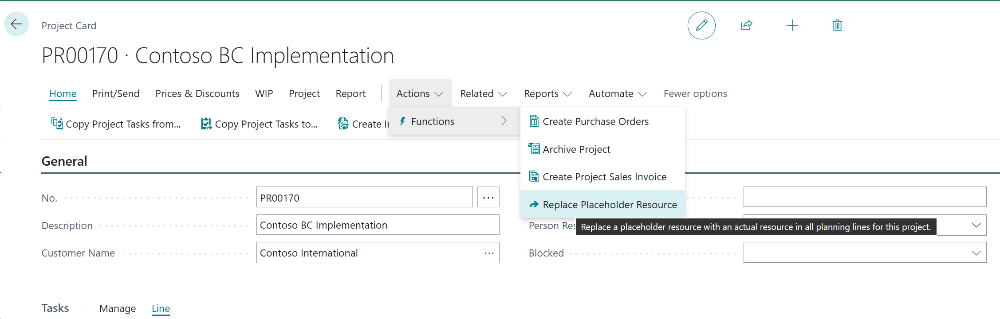
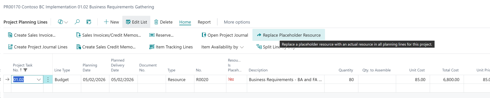
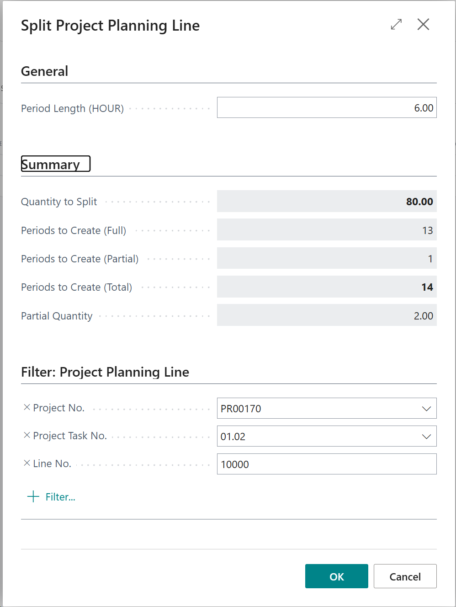

# BC Projects Agent

## Table of Contents
- [Overview](#overview)
- [What's included](#whats-included)
- [Getting Started](#getting-started)
- [Additional setups](#additional-setups)
- [Features](#features)

## Overview

This repository is the companion or test workspace, for the BC Projects MCP Support solution for Dynamics 365 Business Central.

1. I think this projects serves as a good proof of concept of how to use an AI agent that can effectively utilize the MCP Server to interact with Business Central data and perform various project management tasks. As the development progressed, I started having more and more ideas, and decided to draw a line in the sand and submit this version as-is. There are many potential improvements and additional features that could be added in the future.

2. I initially planned to write a lot of complex AL code that the AI agent could call as bound actions, and calculations to base decisions on. Until I realized that if you expose the right data, the agent will be able to read it, reason about it, and make decisions based on the data. See the SamplePrompts.md file for examples of how to prompt the agent to perform various tasks.

3. After quite a number of hours of testing and debugging (and excessive swearing), it appears that the AI tools has some inconsistencies and unexpected behaviors, particularly with certain entities like Resource Skills (referred to from now on, as Competencies for this project).  No matter how I phrased the instructions and the prompts, it kept trying to execute an action on the resource API as if it was a bound action, instead of using the page to create the record. For this reason, the entity set is called `competencies` instead of `resourceSkills` which seems to have resolved the issues encountered. The instructions does make note that the phrases "Resource Skills" and "Competencies" are interchangeable in this context, so the prompts should still work as expected.

4. It does seem necessary to sometimes remind the agent that it needs to the guides and instruction files and follow the instructions.

5. I include a rapid start package to help get started quickly with the MCP Server configuration and setup of some of the calendars. **⚠️ Review the setups before importing!**

6. This solution was built with project management of IT consulting projects in mind. Focussing on resources, tasks and timelines. No restrictions were added to limit use to only certain project types, but the solution may need adjustments to better suit other industries and project types.

## What's included

- BC Projects MCP Support - Workspace (This repository) - Provides a ready-to-use workspace with pre-configured GitHub Copilot Chat settings to interact with the BC Projects MCP Support extension within Business Central.
  - [Repository](https://github.com/ewaldventer/BC-Projects-MCP-Support---Workspace)
- BC Projects MCP Support application 
  - [Source code](https://github.com/ewaldventer/BC-Projects-MCP-Support)
  - [Compiled .app](https://github.com/ewaldventer/BC-Projects-MCP-Support/releases/tag/v1.1.0.0-beta) file for publishing to Business Central
- [Sample Prompts](.docs/SamplePrompts.md)
- Pre-configured Github Copilot Chat configuration for easy integration with VS Code:
  - [Agent](.github/agents/project-agent.agent.md)
  - [Prompts](.github/prompts)
  - [Instructions](.github/instructions/copilot-instructions.md)
- Documentation:
  - [Business Central API Guide](.docs/Business_Central_API_Guide.md)
  - [Projects Module Overview](.docs/Business_Central_Projects_Module_Reference_Guide.md)
- [Rapid start packages](./Demo%20Data/Config.%20Package/) for samples Business Central setup

## Getting Started

- [ ] Create a new Azure Entra App Registration with appropriate API permissions:.
    - `API.ReadWrite.All`
    - `app_access`
    - `Automation.ReadWrite.All `
    - `Financials.ReadWrite.All`
    - `user_impersonation`
- [ ] Publish the PTE .app file to your Business Central environment.
- [ ] In Business Central, create a Microsoft Entra Application Card for the App Registration, with the following permissions:
    - `D365 BASIC`
    - `BTR PROJ-FULL`
    - `D365 JOBS, EDIT`
- [ ] In Business Central create a new MCP Server configuration for the App Registration.
    - Create a new MCP Server configuration, call it PROJECTS as an example
    - Click the `Add Tools by API Group` action, select `braintree` as the API Publisher and `projects` as the API Group.
    - Review the access you want to allow for the MCP Server tools. See suggestions in the `Additional Setups` section below.
- [ ] Configure an MCP Host to interact with the MCP Server, for example:
    - VS Code with GitHub Copilot Chat Extension (requires BcMcpProxy)
    - Claude desktop
    - Copilot Studio

> This example uses VS Code with GitHub Copilot Chat Extension. If using Copilot Studio, be sure to upload the appropriate knowledge documentation. Though after numerous tests, it appears Copilot Studio struggles to utilize the MCP Server effectively compared to VS Code with BcMcpProxy.
>
> The Claude Haiku 4.5 model served me quite well.

- [ ] To host a local MCP Server, either:
    - Extract BcMcpProxy.zip to a local folder, or
    - Download and build the BcMcpProxy from BCTech repo on [GitHub](https://github.com/microsoft/BCTech)    
- [ ] Update global mcp.json with:
    ```json
    {
      "mcpServers": {
        "bc-mcp-projects": {
          "command": "C:\\Path\\To\\BcProjectsAgent.exe",
          "args": [
            "--TenantId", 
            "<Your-Tenant-ID>",
            "--ClientId", 
            "<Your-Client-ID>",
            "--Environment",
            "<Your-Environment-Name>",
            "--Company",
            "<Company Name>",
            "--ConfigurationName",
            "<Your configuration name>"
          ]
        },
        "bc-mcp": {
          "command": "C:\\Path\\To\\BcProjectsAgent.exe",
          "args": [
            "--TenantId",
            "<Your-Tenant-ID>",
            "--ClientId",
            "<Your-Client-ID>",
            "--Environment",
            "<Your-Environment-Name>",
            "--Company",
            "<Company Name>",
            "--ConfigurationName",
            ""
          ],
          "type": "stdio"
        }
      }
    }
    ```

> Note: Configuration Name is the MCP Server Configuration Name you set up in the Business Central. (Page 8351)
> Found the second configuration with a blank Configuration Name useful to allow for tool discovery of the MCP Server.

## Additional setups

For effective use, make sure the following setups are in place in Business Central:

1. A Base Calendar with Base Calendar Changes for non-working days (weekends, holidays, etc.). (_Sample setup added in the configuration package._)
2. Setting the Base Calendar on the Company Information Card - which in retrospect, should be on the Resources Setup, as the setup on the Company Information Card is used for Shipping leadtimes.
3. Work-Hour Templates (_Sample setup added in the configuration package._)
4. Resource Capacity
5. Unit of Measure (_Sample setup added in the configuration package._)
6. Configuration Templates (_Sample setup added in the configuration package._)
  - With the AI agent sometimes have issues following instructions and sometimes API limitations, I found it useful to have some configuration templates set up, as an example, to create Resources. Included in the configuration package is one configuration template for Placeholder Resources.
7. MCP Server Configurations:

| Object Type | Object ID | Object Name | Allow Read | Allow Create | Allow Modify | Allow Delete | Allow Bound Actions |
|-------------|-----------|-------------|------------|--------------|--------------|--------------|---------------------|
| Page | 30009 | APIV2 - Customers | Yes | Yes |    |    |    |
| Page | 50100 | BTR Projects API | Yes | Yes | Yes | Yes |    |
| Page | 50101 | BTR Project Tasks API | Yes | Yes | Yes | Yes |    |
| Page | 50102 | BTR Project Planning Lines API | Yes | Yes | Yes | Yes | Yes |
| Page | 50103 | BTR Resource Capacity API | Yes |    |    |    |    |
| Page | 50104 | BTR Resources API | Yes | Yes | Yes |    |    |
| Page | 50105 | BTR Items API | Yes |    |    |    |    |
| Page | 50106 | BTR G/L Accounts API | Yes |    |    |    |    |
| Page | 50107 | BTR Jobs Setup API | Yes |    |    |    |    |
| Page | 50108 | BTR Config Template Line API | Yes |    |    |    |    |
| Page | 50109 | BTR Project Ledger API | Yes |    |    |    |    |
| Page | 50110 | BTR Employee Absence API | Yes |    |    |    |    |
| Page | 50111 | BTR Base Calendar Changes API | Yes | Yes | Yes | Yes |    |
| Page | 50112 | BTR Resource Skill API | Yes | Yes | Yes |    |    |
| Page | 50113 | BTR Skill Codes API | Yes | Yes | Yes |    |    |
| Page | 50115 | BTR Configuration Template API | Yes |    |    |    | Yes |
| Page | 50116 | BTR Project Document API | Yes |    | Yes | Yes |    |
| Page | 50117 | BTR Excel Sheet Data API | Yes |    |    |    |    |
| Page | 50121 | BTR Excel Sheet API | Yes |    |    | Yes |    |
| Page | 50123 | BTR Project Document Line API | Yes |    |    |    |    |

## Features

1. On the Base Calendar Changes page, you can **import public holidays** for your country from `https://openholidaysapi.org`
  - Unfortunately, the API does not support all countries yet. An alternative is to ask the AI agent to fetch public holidays from another known website or service (https://date.nager.at/Api) and create the Base Calendar Changes records using the Base Calendar Changes MCP tools.
    - Example prompt: "Can you #fetch https://date.nager.at/Api, review the api documentation and fetch the public holidays for 2026 in Denmark?"
2. When building proposal project plans, you can create **placeholder resources**, and later have the AI agent replace the placeholder resources with actual resources based on skillsets. The functionality also exists on the front-end to replace placeholder resources using the Replace Placeholder Resource action on the:
  - Project Card 
  
  - Project Planning Lines 
  
  The intention is to create role-based placeholder resources, e.g., "Senior Developer", "Project Manager", "Business Analyst", etc., to then later find the best matching actual resource based on competencies/skills, availability, and other factors (using the A.I. agent or manually).
  It 
3. **Split Line by Day** action on the Project Planning Lines to quickly split a planning line into multiple lines, one for each day. Useful when needing to adjust work on specific days and track the actual duration of a project. Because the Task view shows the Start and End Dates based on the min and max Planning Date on the Planning Lines. Splitting lines by day allows for more granular control of the project schedule. This takes into account non-working days based on the Base Calendar.

4. **Project Documents Management** - Provides document storage and parsing capabilities for project-related files:
   - **Project Document Header** - Stores metadata for uploaded documents (Word, Excel, Text, CSV, XML) including document name, type, description, and association to a project
   - **Project Document Line** - Stores parsed text content from documents in line-based format, enabling searchable content storage. Word documents are converted to HTML for rich text representation.
   - **Excel Sheet** - Represents individual sheets within uploaded Excel files
   - **Excel Sheet Cell** - Stores granular cell-level data from Excel sheets including cell values and references, allowing detailed analysis and extraction of spreadsheet information
   - Supports document upload, automatic parsing, and structured storage of various file formats to make project documentation accessible and queryable within the system.


